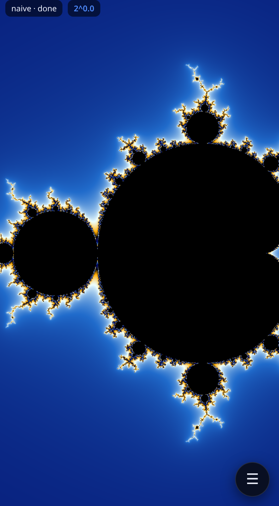

# Mandelbrot Deep Zoom

A mobile-first Mandelbrot viewer that zooms past the limits of double precision
using **perturbation theory** with **Zhuoran rebasing** for glitch-free deep
zoom, rendered on the **GPU** with WebGL2 shaders. Pure JS + HTML + CSS, no build
step. Every engine is validated against a BigInt-exact oracle (CPU engine to
**2^400**; the GPU floatexp/rescaled engines vs the CPU/BigInt oracle from the home
view all the way down to the **double-precision wall at ~2^-1010** — where the
per-pixel `dc` runs out of mantissa, past which the viewer clamps and signals "max
depth"). Point-filtered + **supersampled** for a crisp, anti-aliased "ultra" look.



## Try it

```bash
npm install        # Playwright 1.61.0 (for the e2e tests)
npm run serve      # http://127.0.0.1:8137
```

Open the URL on a phone or in a browser. A one-time **gesture hint** explains the
controls on first visit (re-open it any time with the **?** button or key).
**Click / tap anywhere to recenter there
and zoom in** (shift / ctrl / right-click to zoom out); pinch / drag to zoom and
pan; scroll-wheel zooms about the cursor on desktop. On a keyboard, **arrow keys
pan**, **+ / −** zoom, **f** toggles fullscreen. The HUD always shows the current
zoom level and the view-center coordinate (in `a + bi` form). While you zoom, the current
image is scaled as a live preview and the sharp re-render kicks in once the motion
settles — and a deep render then **replaces that preview with high-res tiles top-to-bottom
as they finish**, so you never stare at a black screen mid-render. The ☰
button opens controls: iteration count (slider + a number field for exact values),
**supersampling** (Off / 2× / 3× / 4× anti-aliasing) with a **Force high quality**
override for full AA on extreme-depth captures, palettes, a precise
coordinate box, shareable deep-zoom links, a **glitch overlay** debug toggle
(tints any Pauldelbrot-suspect pixels magenta and reports a real glitch count — see
below), and a **low-power** battery-saver toggle. The image is **point-filtered**
(crisp, not bilinear-blurry) when scaled to the screen and during zoom gestures.

## How it works

The maths is perturbation theory; the per-pixel work runs in **WebGL2 fragment
shaders** (`src/gpu/`). The high-precision **reference orbit** is computed once on
the CPU in BigInt fixed-point (`src/math/bignum.js`, `reference.js`) and uploaded
as a texture; the GPU then solves every pixel by the **delta iteration**
`δ' = 2·Z·δ + δ² + δc` with **Zhuoran rebasing** (glitch-free from one reference).

**Series approximation** (`src/math/series.js`, default on, CPU **and GPU**): at deep
zoom `δ` stays in the linear regime (`δ ≈ A_n·δc`) for almost the whole orbit, so a single
polynomial-in-`δc` seed lets *every* pixel start hundreds-to-thousands of iterations in —
**~92 % of the iterations skipped at 2⁻⁵⁰⁰**, bit-exact escape counts. It is orthogonal to
rebasing (rebasing = precision, SA = iteration count). The skip is chosen adaptively and
safely (a probe grid + an escape guard) and shown in the debug line. The deep GPU rescaled
shader seeds `δ` in-shader via a floatexp Horner (the coeffs ride in as uniforms), measured
**~6–13× faster on a real RTX 3090** (raised by order-5 SA + the depth-adaptive safety margin
below) over 2⁻¹²⁰…2⁻⁴⁰⁰ — validated bit-for-bit against the no-skip CPU oracle. One **Series
approximation** toggle controls both paths. Two refinements stack on it, both bit-exact:
**order-5** (vs order-3) terms extend the skip most at the moderate-deep gap, and the SA skip's
**safety margin is depth-adaptive** (0.05→0.02 below 2⁻¹¹², where the GPU's df64 seed is measured
~1000× under the bit-exact gate) — together **~1.1–1.5× more** at 2⁻¹²⁰…2⁻⁴⁰⁰
(`npm run bench:samargin` / `bench:saorder:real`), so the deep band (≥2⁻²¹⁸) now reaches/exceeds 10×.
One inner-loop refinement rides on top (Spawn 27): the deep engine's reference texel fetch is
**software-pipelined** — issued a full iteration before first use so its latency hides under the
escape-test ALU. Bit-identical by construction, **1.01–1.08× on the real RTX 3090** (growing with
depth) and **~2.0× on SwiftShader** (the CPU-rasterizer backend GPU-blocklisted devices get);
`npm run bench:prefetch`. (A dedicated one-split df64 squaring `ds_sqr` was built + validated too,
but measured neutral-on-GPU / slightly-negative-on-SwiftShader → kept opt-in; `npm run bench:sqr`.)

**BLA — bivariate linear approximation** (`src/math/bla.js`): SA skips the *leading* linear run
once, but the deep orbit is a *sequence* of linear runs — every rebase resets `δ` small and it
re-grows linearly again. BLA precomputes, from the reference alone, a binary tree of bivariate-linear
maps `δ_{m+L} = A·δ_m + B·δc` with per-run validity radii, so a pixel jumps whole runs *throughout*
the orbit (including after every rebase) — exactly the post-rebase phases SA cannot touch. On the
**CPU** it cuts the kept work **~2.5–3.3× on top of SA** (`npm run crosscheck:bla` / `arbiter:bla`),
an approximation (drops `δ²`) validated by BigInt arbitration to drift only ±small on a handful of
high-count pixels. **The GPU port is built and validated correct on real hardware** (floatexp table
texture; `npm run crosscheck:gpu:bla:real`) **but is a measured performance NEGATIVE — it is kept
OFF.** On the GPU, SA+BLA runs ~1.6–2× *slower* than SA alone: BLA's iteration savings are real but a
table-scan step costs far more than a rescaled iteration (texture-fetch latency vs ALU; warp
divergence in the chaotic post-SA tail). Three scan optimizations (level-1 early-out, binary-search,
carried `|δ|²`) narrowed but never closed the gap. **SA is the right and sufficient GPU lever; BLA is
a CPU-centric win.** `npm run bench:bla:real`; full writeup in NOTES "⚠️ BLA GPU PORT".

The engine is dispatched by zoom depth (`gpuEngineForRadius` in `render.js`):

| radius | engine | precision |
|---|---|---|
| ≥ 2⁻² | GPU **naive** | float32 (shallow; whole-set view) |
| 2⁻² … 2⁻¹¹² | GPU **perturbation** | **df64** (double-single, ~46-bit) reference + deltas |
| 2⁻¹¹² … **2⁻¹⁰¹⁰** | GPU **perturbation** | **floatexp**-precision (df64 mantissa + int exponent), via the faster **rescaled** engine — the deep / **~2²⁷⁰…2¹⁰¹⁰** path |
| GPU off (any depth) | CPU **perturbation** | double (the validated oracle, to 2^400) |
| < 2⁻¹⁰¹⁰ | **clamped** | the double-precision wall — `dc`/step would go subnormal; the viewer holds the radius and signals "max depth" |

Why df64 for the deep GPU path: plain float32 perturbation looks fine until the
iteration count climbs, then the float32 reference's reconstruction error
(`z = Z + δ`, ~2⁻²⁴) amplifies on chaotic boundary pixels and 10–30 % of them go
wrong. Double-single arithmetic (two float32 ≈ 46-bit) cuts that to <1 % — within
the genuine 46- vs 53-bit gap on measure-zero pixels.

Why **floatexp** below 2⁻¹¹²: df64 widens the mantissa but keeps float32's exponent,
so the per-pixel offset `δc ~ 2⁻²⁷⁰` underflows (min normal 2⁻¹²⁶) and the df64 path
floors at ~2⁻¹¹². The floatexp engine stores each small delta as a df64 mantissa
**plus a separate int exponent** (`m·2ᵉ`), keeping the 46-bit precision while the
exponent reaches the full double range. The arithmetic is exponent-magnitude-agnostic,
so the floor is set by where the per-pixel `dc`/step (plain doubles) go subnormal — the
**precision wall at 2⁻¹⁰¹⁰** (validated bit-exact against the BigInt oracle at a genuine
deep boundary coordinate; see `NOTES.md` "DEEP PRECISION WALL"). The reference orbit stays
df64 (it's O(1)); only the deltas carry the exponent. (Details + the BigInt arbiter that
proved the residual is precision, not a bug, in `NOTES.md`.)

Why **rescaled** for that band's speed: floatexp carries a separate exponent on every
delta component and renormalizes after *every* arithmetic op. The rescaled engine
instead gives the delta `δz = (δx,δy)` **one shared exponent** so the per-iteration
update runs in plain df64 and renormalizes once — ~1.3× faster on the worst-case
chaotic valley (more on smooth regions / real GPUs) at the **same precision** (it still
does the escape/rebase test in exact floatexp, so the glitch-free rebase decision is
identical). `validate-gpu` gates it against the CPU oracle at the same thresholds as
floatexp; `floatexp` stays in the renderer as the reference and a one-line fallback.

**Supersampling** computes the fractal at ss× the display resolution and box-averages
the subsample *colors* down (averaging the cyclic smooth-count would bleed hues);
the display→screen scale stays point-filtered so the result is crisp, not blurry.
Past ~2⁻³⁰⁰ the effective supersampling auto-drops to 1× (running the heavy deep shader
on ss² the pixels would make a 2⁵⁰⁰ frame ~4× slower for AA the fractal's density mostly
hides). **Force high quality** overrides that cap for a deliberate slow high-AA capture —
it only lifts the *depth* cap; the memory/texture-size caps still apply, and it isn't saved
in the share URL (so a bookmark won't hand someone a silently slower render).

Coloring is in-shader from a CPU-baked palette LUT (no readback), so palette and
color-cycle changes are instant. A **Web Worker** computes the reference off the
main thread. Turn the GPU off in the controls to fall back to the CPU worker pool.

**Strip-tiled deep render**: past ~2²¹⁸ a frame needs ~55k iterations, and a single
GPU draw at that count runs long enough to trip the GPU **watchdog** (TDR) on real
hardware — the practical reason deep zooms used to hang. The escape pass is split into
short horizontal **strips** drawn one at a time (scissor), yielding between them, so no
single draw exceeds the watchdog; the image reveals top-to-bottom and any zoom cancels
it instantly. It's **bit-identical** to one big draw (the scissor keeps `gl_FragCoord`
global). Measured separately: the deep engines match the CPU oracle to **0.000%** out to
2⁻²⁷¹ — the 2²¹⁸ wall was the watchdog, not precision. The strip budget is **SA-skip-aware**
(Spawn 28): series approximation seeds every pixel at iteration `skip`, so strips are sized
on the true worst case `maxIter − skip` — same watchdog envelope, ~20× fewer strips deep,
which cut the per-strip orchestration that had grown to ~35% of a deep frame (1.4× offscreen,
3.2× on the main-thread fallback at 2⁻⁴⁰⁰; `node tools/probe-strips.mjs`). With the GPU that fast,
the **CPU BigInt reference build** became the deep frame's dominant cost — it's now 2.5× faster
(2-mult complex square, a bit-exact 5→3-mult oracle, and a `Number(BigInt)` fast path replacing an
O(prec) string probe in `toDouble`; `node tools/bench-ref.mjs`), all gated bit-exact against the
BigInt oracle out to 2⁻¹⁰²⁸ (`npm run probe:wall`). A cold 2⁻⁴⁰⁰ frame is ~0.58s end-to-end — and
**interactive zoom ticks reuse the cached reference AND series-approximation coefficients** (the
orbit extends bit-identically from its BigInt tail; the SA coeffs stay valid because a zoom-in's
dc box nests inside the validated one), so successive deep zoom settles run **~100ms (~5×)**,
with a worker-side SA refresh every few octaves (`node tools/probe-refcache.mjs`).

**WebGL context-loss recovery**: mobile GPUs drop the WebGL context under memory
pressure or when the tab is backgrounded. The viewer survives it — while the context
is lost it renders on the CPU worker pool (the validated oracle, so the image is never
*wrong*, only slower), and it re-renders on the GPU automatically once the browser
restores the context (recreating all GL objects). Repeated losses make it stay on the
CPU rather than flip-flop. Simulated and gated in tests via `WEBGL_lose_context`.

**Glitch overlay (debug)**: rebasing makes the single-reference render glitch-free, but
the perturbation engines still emit a **Pauldelbrot** glitch flag (`|δ|² ≪ |Z_m|²`). On the
GPU it lives in the smooth-count texture's `.b` channel; on the **CPU** the workers post a
per-pixel mask per band. The "Glitch overlay" toggle surfaces it on *both* paths — flagged
pixels are tinted magenta and the real flagged-pixel count is shown in the status line (GPU
renders otherwise report a structural `0`, since the diagnostic is off by default). It's
**purely diagnostic**: enabling it does not change the escape/rebase math or the rendered
fractal (default renders are byte-identical — the mask is only built when the overlay is on)
— it just lets you *confirm* a deep view is glitch-free, or spot the rare exception.

**Low power (battery saver)**: a toggle that trades detail for far fewer pixel-iterations per
frame — lower DPR + backing resolution, supersampling forced off, and a lower auto-iteration
ceiling (a manually typed iteration count is still honoured). It auto-enables on a low,
discharging battery (`navigator.getBattery`, where supported) until you touch the toggle.
The per-sample math is unchanged, so it's purely a perf/energy knob.

**OffscreenCanvas GPU worker**: the GPU escape+color raster runs entirely off the main
thread in a dedicated worker that owns the WebGL context + an OffscreenCanvas and pushes
finished `ImageBitmap` strips back — so a long deep render no longer janks input/scroll
(main-thread blocking dropped from ~the entire render to **0ms** of Long Tasks at 2⁻²⁷¹ on
SwiftShader; the animation heartbeat survives the whole render). It's the default when
supported, **pixel-identical** to the legacy on-main-thread path, and falls back cleanly
(on-main-thread renderer → CPU pool) where OffscreenCanvas/WebGL2 is absent. The deep-frame
throughput is unchanged (it's warp-divergence bound) — this is purely a responsiveness win.
`npm run crosscheck:offscreen` / `bench:offscreen` / `probe:recover:offscreen`.

See `NOTES.md` for the math, precision analysis, and design decisions, and
`AGENDA.md` for status and what's next (pushing the deep floor below 2⁻⁶⁰⁰; fewer
per-iteration texture fetches). A **df64 escape/rebase fast-path** was built + validated
bit-for-bit-correct on the real RTX 3090 but measured **performance-neutral** (the
escape block's cost is the shared `ds_mul` squarings + the reference fetch, not the
floatexp-normalize wrapper it removes), so it is kept **off** (`uDf64Esc`, opt-in) —
this independently confirms the BLA finding that the GPU's SA floor is not
per-iteration-ALU-bound. `npm run bench:df64esc:real`; NOTES "df64 ESCAPE".

## Correctness & tests

- `npm test` — 41 Node unit tests. The key ones compare the perturbation engine
  against a **BigInt-exact oracle** (`escapeBigInt`) pixel-for-pixel at
  2⁴⁵, 2¹²⁰, 2¹⁰⁰ and **2⁴⁰⁰** (±1 iteration, the floating-point boundary limit);
  plus the floatexp split round-trip (to 2⁻³⁴⁰), the depth→engine dispatch, and
  **series approximation** (bit-exact escape counts vs the no-skip render at 2¹⁰⁰;
  every shallow-band difference is a BigInt-confirmed ill-conditioned pixel).
- `npm run e2e` — Playwright suite (mobile + desktop): loads, renders, pans,
  zooms, **click-to-zoom** (recenter + zoom, real-mouse wiring), deep-zoom-by-
  coordinate, palette recolor, URL-hash round-trip, deterministic golden
  fingerprint, glitch-free perturbation, **point-filter + supersampling**, plus a
  **GPU suite** (WebGL2 present, GPU-vs-oracle match at home and deep, engine
  dispatch, CPU fallback, **WebGL context-loss recovery**, **glitch overlay** — a
  forced high tolerance lights up the flag → readback count → magenta tint end-to-end),
  the **Force high quality** override (lifts the deep ss cap but not the memory caps),
  and **perf budgets** (time-to-first-pixel + full-frame on the home view — loose
  catastrophic-regression guards, since SwiftShader on a shared host would flake tight ones).
- `npm run bench:gpu` — times the floatexp vs **rescaled** perturbation shaders on
  this host's GL (the rescaled engine is ~1.26× faster on the worst-case chaotic
  valley; Spawn 5's earlier wins were ~2× fe, ~2.4× df64).
- `npm run crosscheck:sa` — proves CPU **series approximation** matches the no-skip render
  (0 escape-count mismatch 2⁻⁵⁰…2⁻⁵⁰⁰ on a genuine deep boundary coordinate) and prints the
  skip % + speedup table. `npm run probe:sa` reports the raw skip potential across depths;
  `npm run probe:sa:cap` shows the coarse-pass min-escape cap is non-binding (why the GPU SA
  omits it). The **GPU** SA is gated by `validate:gpu`'s "rescaled + SERIES APPROXIMATION"
  section (GPU-with-SA vs the no-SA oracle); `npm run bench:sa:real` times the speedup and
  `npm run probe:sa:viewer` drives the live app (SA on vs off → same picture) — both `GPU=1`.
- `npm run crosscheck:skip` — proves the perturbation **fast-skip** is bit-identical
  (renders each view with the skip on AND off → 0-diff full image, all three engines).
- `npm run crosscheck:tiled` — proves the **strip-tiled** deep render is bit-identical to
  a single full-frame draw (0-diff across naive/df64/fe/rescaled, all depths incl. 2⁻²¹⁸,
  strip heights from 1 row to larger-than-frame). The gate for the "zoom past 2²¹⁸" fix.
- `npm run probe:rescaled` — checks the rescaled engine vs the CPU oracle and vs floatexp.
- `npm run probe:deep218` — measures deep **chaotic** GPU-vs-oracle mismatch at 2⁻⁹⁰…2⁻²⁷¹
  on a real deep coordinate (it's 0.000% — confirming the 2²¹⁸ wall was the watchdog, not
  precision).
- `npm run validate:gpu` — the canonical GPU regression: renders the GPU naive /
  df64 / **floatexp** / **rescaled** perturbation engines headless (SwiftShader) and
  compares to the CPU/BigInt oracle across 2⁰ … 2⁻³⁴⁰, gating on bulk-agreement metrics.
  `npm run smoke:gpu` drives the real app and checks GPU↔CPU parity + captures
  screenshots; `node tools/shoot-ss.mjs` captures a supersampling off-vs-4× pair.

> NixOS note: the Playwright-bundled Chromium can't run here; the config uses a
> nix-store Chromium with `--headless=new`. Details in `NOTES.md`.

## Project layout

```
index.html, styles.css      mobile-first UI
src/main.js                 UI wiring, status, URL-hash bookmarks
src/viewer.js               canvas, HP view state, gestures, GPU/CPU dispatch
src/worker.js               reference-orbit + CPU render worker
src/palette.js              smooth-count -> RGB (+ GPU LUT helper)
src/gpu/glsl.js             GLSL shaders (naive f32/df64, perturb f32/df64, color)
src/gpu/renderer.js         WebGL2 renderer (programs, float FBO, reference texture)
src/gpu/gpu-worker.js       OffscreenCanvas GPU render worker (off-main-thread raster)
src/gpu/gpu-worker-client.js  main-thread bridge to the GPU worker (strip compositing)
src/gpu/validate.js         GPU-vs-oracle comparison (naive / perturb / BigInt arbiter)
src/math/naive.js           double-precision oracle
src/math/bignum.js          fixed-point BigInt reals (decimal/double IO)
src/math/reference.js       high-precision reference orbit + BigInt-exact oracle
src/math/perturb.js         perturbation delta iteration + rebasing (+ optional SA seed)
src/math/series.js          series approximation: skip the leading iterations (CPU)
src/math/render.js          reference auto-selection + full render + engine dispatch
test/unit/*.test.mjs        node --test correctness suite
test/e2e/*.spec.mjs         Playwright integration tests (incl. gpu.spec.mjs)
test/gpu/harness.html       in-browser GPU validation harness
tools/serve.mjs             static dev server (COOP/COEP)
tools/validate-gpu.mjs      GPU-vs-oracle depth sweep   ·  tools/arbiter-gpu.mjs (BigInt arbiter)
tools/smoke-viewer.mjs      drive the app + GPU/CPU parity  ·  tools/probe-webgl.mjs (caps)
tools/shoot.mjs             screenshot capture
```
